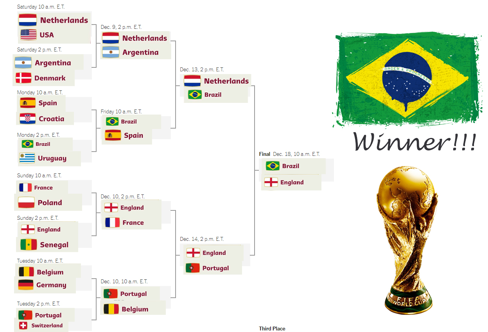

# World-Cup-2022-Winner-Prediction

A brief about the notebook:

1-Data Reading & Understanding

2-Data Cleaning & Wrangling

3-Data Analysis

4-Data Pre-processing

5-Modeling and it's Evaluation

6- Model Optimization

7- Matches Simulation

